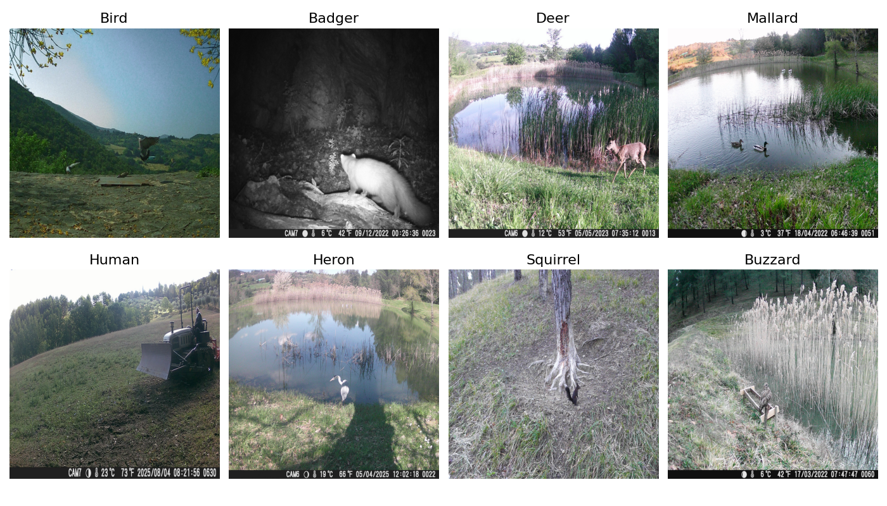

# aculei-ai

This project aims to extract data from images and classify image subjects to build a dataset. Images are hunter-camera photograps, mostly black and white with some metadata at the bottom of the image.

Using zero-shot-image-classification from [hugging-face](https://huggingface.co/docs/transformers/tasks/zero_shot_image_classification) we were able to classify animals appearing hunter-camera photo shots with some high degree of accuracy.

Then we used [ocr techinques](https://en.wikipedia.org/wiki/Optical_character_recognition) combined with [exif](https://en.wikipedia.org/wiki/Exif) tools to extract metadata from the image itself and from exif data.

Dataset is available under [CC BY-NC-SA 4.0](https://creativecommons.org/licenses/by-nc-sa/4.0/deed.en) but images are not open-sourced since are property of the photographer.
